

    

        
    

# ICEPOS开源收银系统-UNIAPP会员中心

#### 介绍
UNIAPP会员中心---- 使用UNIAPP+VUE2.0开发，兼容双平台:H5 + 微信小程序。完美对接ICEPOS管理后台(PHP/Thinkphp5.1/Thinkphp8.1),即原ICEPOS收银客户端的后台接口和数据！现已可以通过UNIAPP注册会员、绑定手机号、微信授权登录、微信手机号快捷登录等获得会员信息。原C#收银客户端可通过会员二维码快速扫码录入手机号或会员编码，进行会员录入，快速下单！会员中心功能还包括:订单查询、会员积分明细、优惠券领取（标准版）、账户余额变动、会员条码、订单号复制、年度账单、会员信息修改等特色功能。

#### 官方网站
[https://www.icepos.cn](https://www.icepos.cn)

#### 技术交流
QQ 群号:967490959 (ICEPOS技术交流群1)

    

     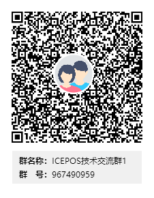
    

#### 小程序展示

    

     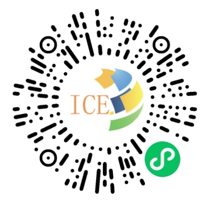
    

### 小程序用户隐私保护指引，勾选项目（除非您二次开发需要更多权限，否则可按下图勾选即可）

    

     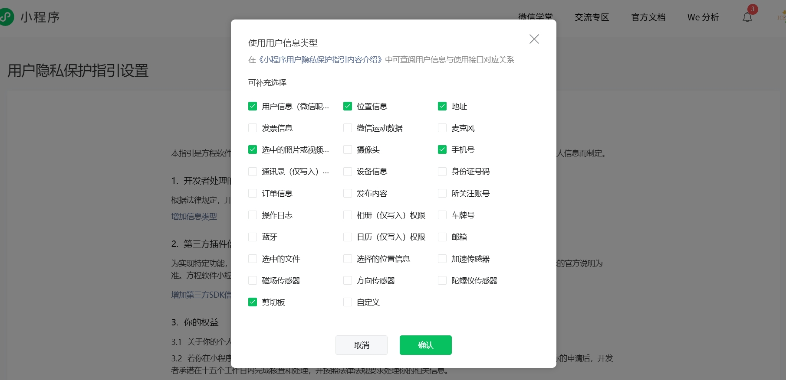
    

### 实例运行图展示

会员中心首页

    

        
    

会员中心首页优惠券领取列表(标准版)

    

        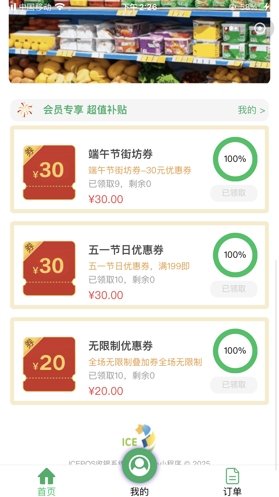
    

微信小程序授权登录界面

    

        
    

微信小程序手机号快捷验证授权登录界面

    

        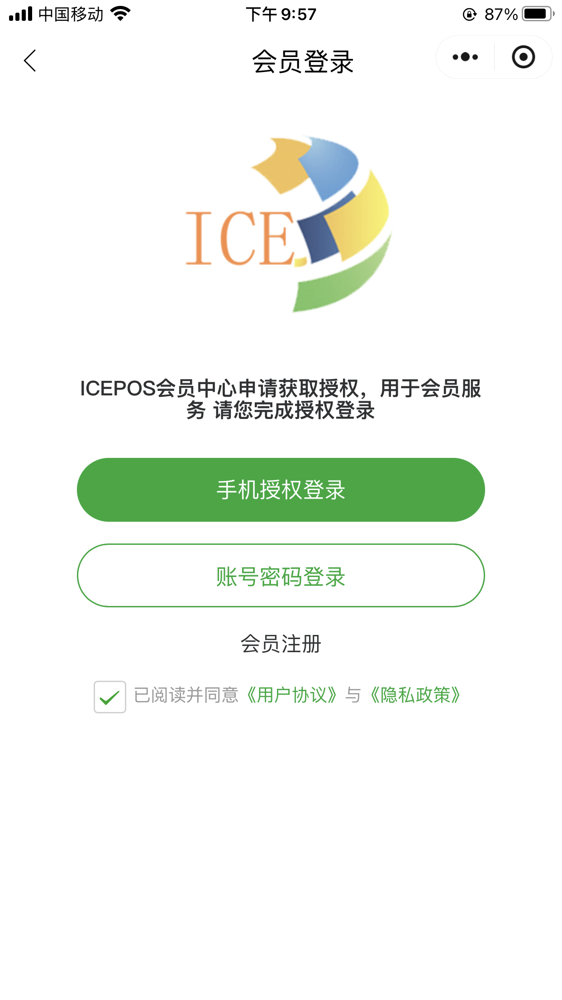
    

微信小程序手机号快捷验证授权执行后界面

    

        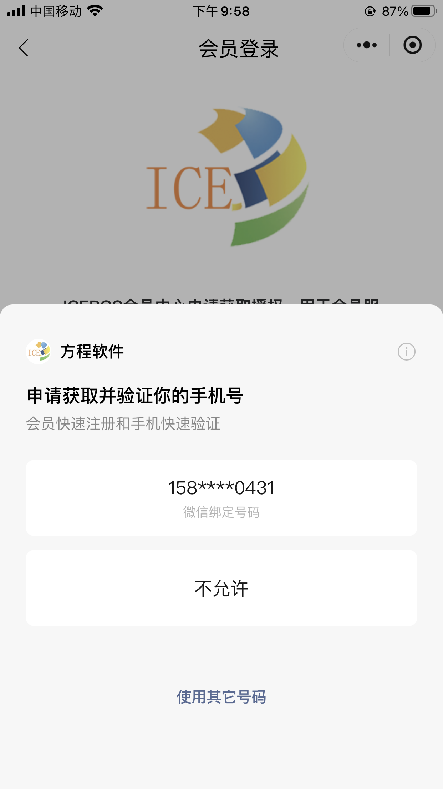
    

手动输入账号密码登录界面（适合线下新增会员登录）

    

        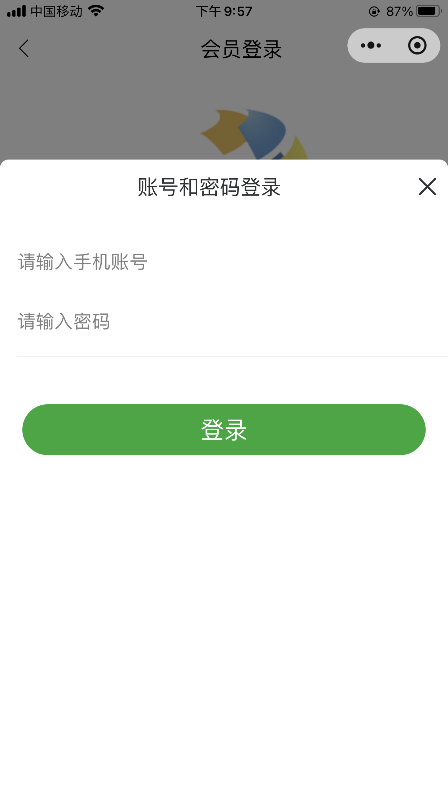
    

会员条码界面

    

        
    

会员中心首页界面

    

        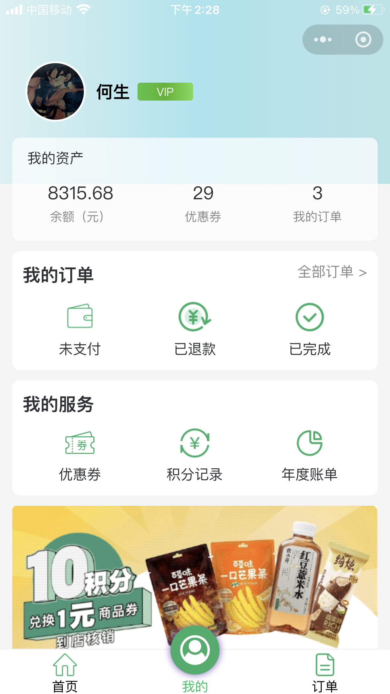
    

订单列表

    

        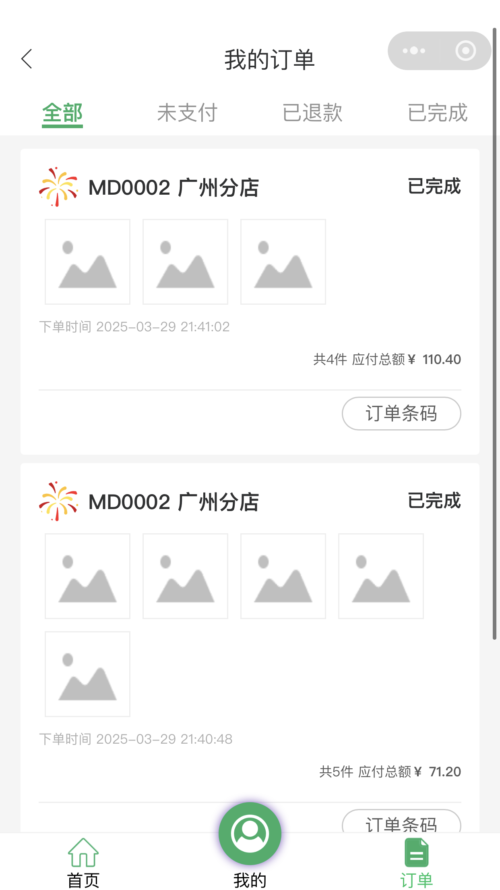
    

订单明细

    

        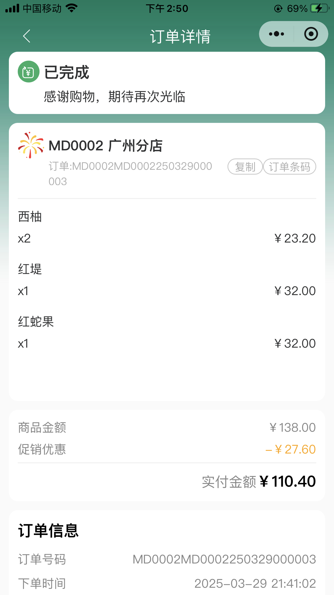
    

订单条码

    

        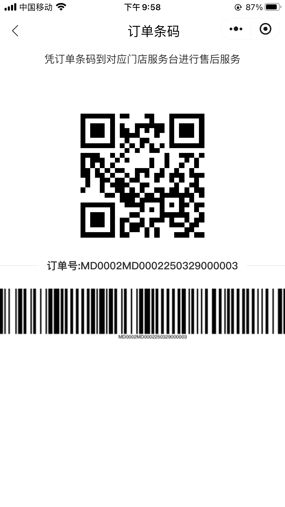
    

优惠券列表（标准版）

    

        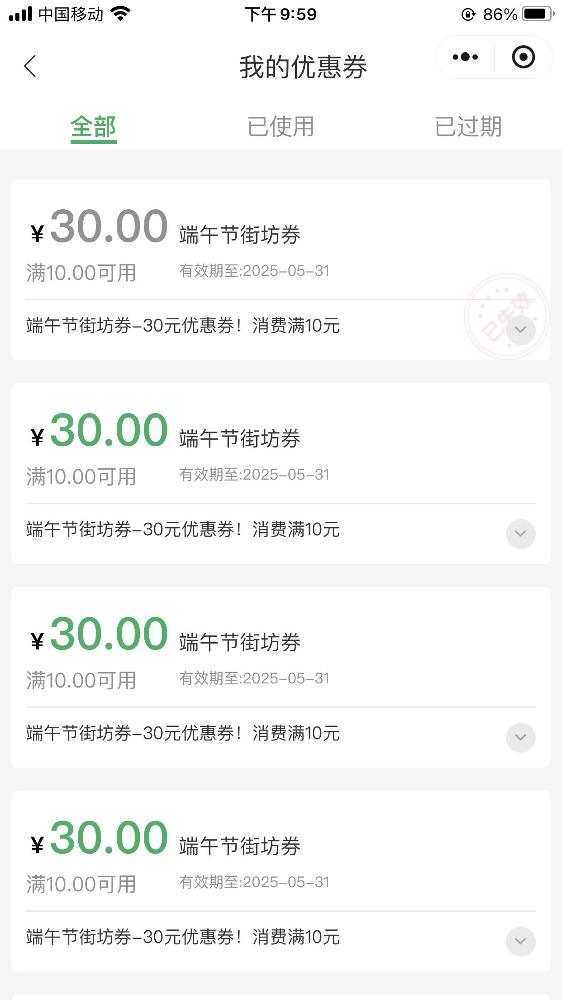
    

优惠券条码窗口

    

        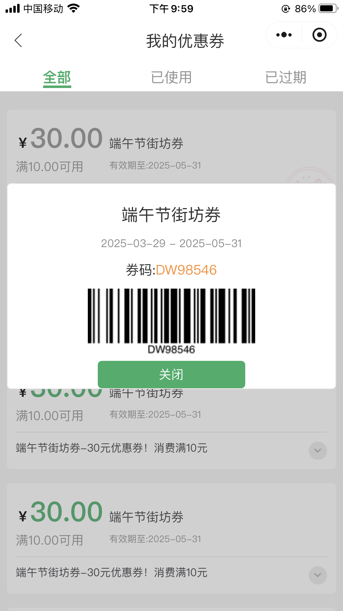
    

积分明细列表

    

        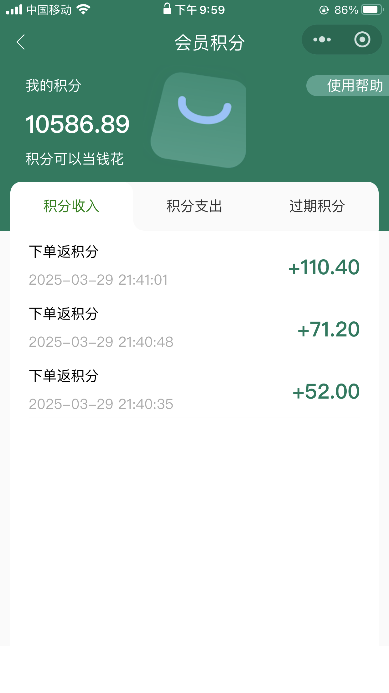
    

会员年报（1）界面

    

        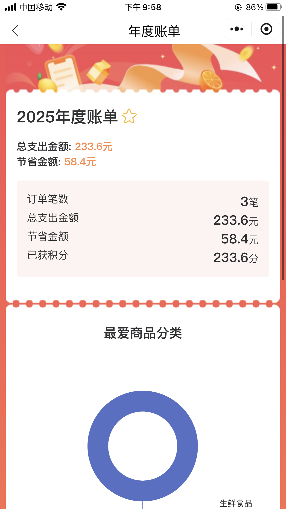
    

会员年报（2）界面

    

        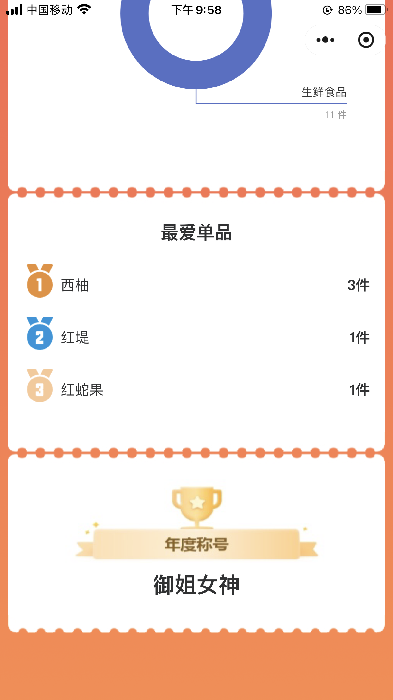
    

会员账户列表

    

        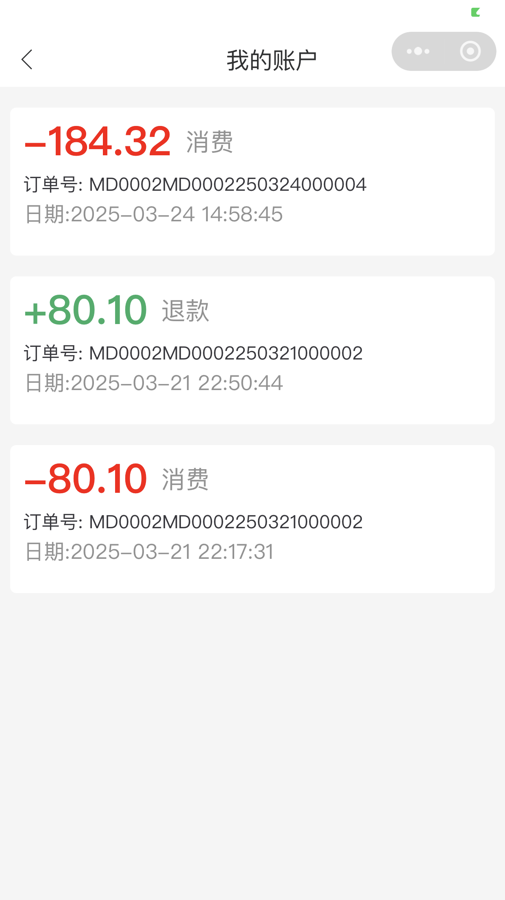
    

资讯列表

    

        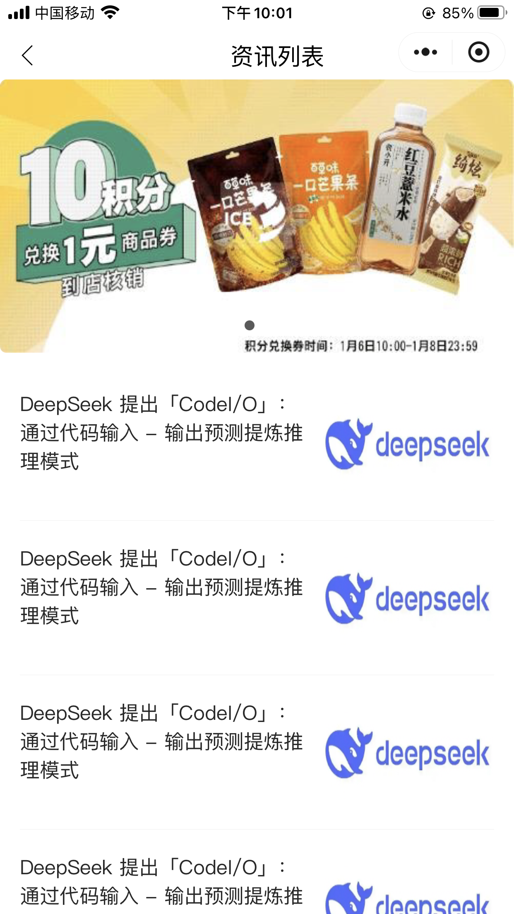
    

